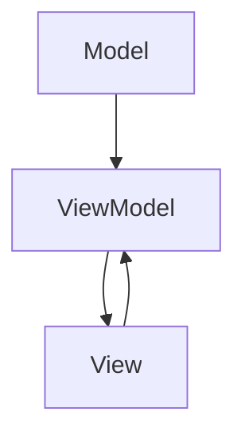

# MemorizeApp – Architecture Documentation

## 1. Overview

**MemorizeApp** is a memory card matching game for iOS, built using SwiftUI and following the MVVM (Model-View-ViewModel) architecture.  
This document describes the high-level structure, component responsibilities, and data flow within the application.

---

## 2. Architecture Diagram



---

## 3. Component Responsibilities

### **Model**
- **Purpose:** Represents the data and business logic of the application.
- **Key Components:**
  - **Card:** Represents a single card in the game (symbol, face-up state, matched state).
  - **GameState:** Manages the current state of the game (cards, score, game over status).
- **Responsibilities:**
  - Hold and manage game data.
  - Enforce game rules (e.g., card matching, score calculation).

### **ViewModel**
- **Purpose:** Acts as a bridge between the Model and the View, handling user input and updating the Model.
- **Key Component:**
  - **GameViewModel:** Manages the game state, processes user actions, and updates the Model accordingly.
- **Responsibilities:**
  - Respond to user actions (e.g., card tap, restart).
  - Update the Model based on user input.
  - Provide data to the View for display.

### **View**
- **Purpose:** Displays the user interface and handles user interaction.
- **Key Components:**
  - **CardView:** Displays a single card and handles tap gestures.
  - **GameView:** Displays the card grid, score, and restart button.
  - **ContentView:** (Optional) Main entry point for the app.
- **Responsibilities:**
  - Render the game UI based on data from the ViewModel.
  - Send user actions to the ViewModel.

---

## 4. Data Flow

1. **User interacts with the View (e.g., taps a card).**
2. **View sends the action to the ViewModel.**
3. **ViewModel processes the action and updates the Model.**
4. **Model updates its state (e.g., card is flipped, score is updated).**
5. **ViewModel updates the View with the new state.**
6. **View re-renders to reflect the updated state.**

---

## 5. Folder Structure

```
memorizeapp/
├── src/
│   ├── Model/
│   │   ├── Card.swift
│   │   └── GameState.swift
│   ├── ViewModel/
│   │   └── GameViewModel.swift
│   └── View/
│       ├── CardView.swift
│       ├── GameView.swift
│       └── ContentView.swift
├── docs/
│   └── architecture.md
└── ...
```

---

## 6. Additional Notes

- **Single Source of Truth:** The Model is the single source of truth for game data.
- **Decoupling:** The MVVM pattern decouples the UI from the business logic, making the code easier to maintain and test.
- **Observable State:** SwiftUI’s `@Observable` (or `ObservableObject`) is used to automatically update the View when the Model changes.

